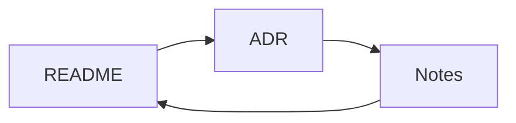

# ADR 0001: links inside documents

## Context

A document is one node of a set of linked files. Before, clicking a link
inside the editor did nothing.

## Decision

Links resolve against the open file and open in the same screen.

you asked for line 17: this is it.

## Consequences

- Back returns to the source document.
- A dead link says so.

## Consequences

This second "Consequences" heading is numbered `consequences-1` by the slug
rule, so [a link to it](0001-links.md#consequences-1) lands here, not above.



Fenced code is skipped when looking for headings, so this heading inside a
fence is never a target:

```
## Not a heading
```

Filler so the file scrolls. Click near the end, then follow the link below.

line 40
line 41
line 42
line 43
line 44
line 45
line 46
line 47
line 48
line 49
line 50

[Back to the walk-through](../README.md#4-back-returns-to-where-you-were-not-to-the-links-line)
