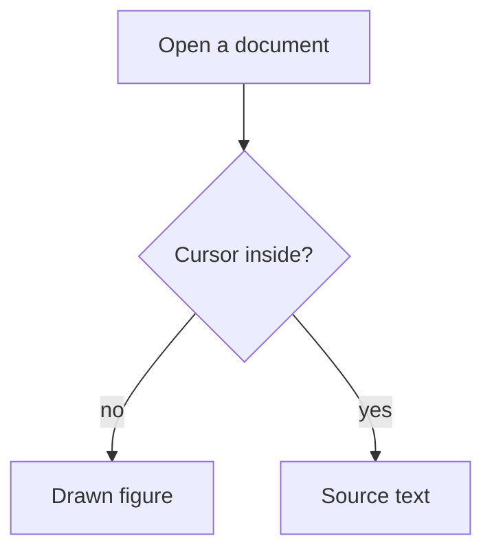
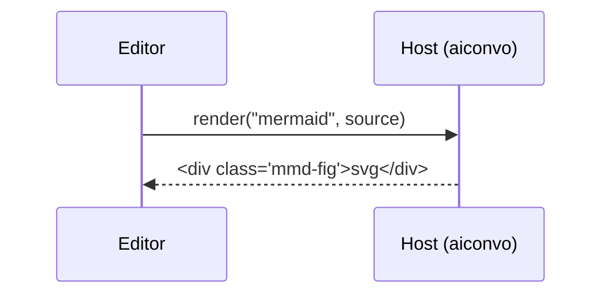

# Diagrams in the editor

Each fence below says what it should look like. Click inside a drawn diagram
to see its source; click outside (or press Escape and move away) to see the
drawing again.

## 1. A simple graph, drawn



## 2. The same graph again: drawn once, shown twice

Identical source is drawn only once and reused. The two figures should be
pixel-identical.


## 3. A sequence diagram



## 4. A broken diagram: the error above the source

This should show a red "⚠ mermaid: Parse error…" line with the source under
it, not a blank box. Fix the typo (change `grph` to `graph`), click out, and
it draws.

```mermaid
grph LR
  X --> Y
```

## 5. Not a diagram: plain code stays code

```js
const x = 1; // highlighted JavaScript, no figure
```

## 6. A blank fence is never drawn

```mermaid
```

## 7. Theme switch

Switch the app theme (Settings → appearance, or the theme shortcut). Every
diagram above redraws in the new colours, in this document and in any
transcript that is open.

## 8. An open fence at the end of the file is never drawn while you type

Type after the line below; nothing draws until you close the fence with
three backticks.

```mermaid
graph LR
  typing --> here
